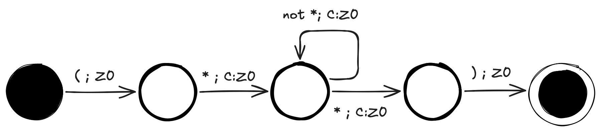

Let us recap a bit on the lexing problem. We have built a lexer based on regular languages. 
Regular languages are defined from a grammar having the following form:
> - A -> ε
> - A -> a
> - A -> aB

Where _ε_ is the empty string, _a_ is a terminal symbol (character), and _A_ and _B_ are non-terminal symbols (other rules)

Why is this enough to recognize comments in Oberon? This grammar could do the trick?
> - S -> '('S1
> - S1 -> '*' C
> - C -> '*' C1 
> - C -> cC
> - C1 -> ')'

This little grammar would recoginize a comment in Oberon like 

'**(* this is a comment *)**', 

but in Oberon comments can be nested. I can write this in Oberon

'**(* this is a comment (* and so is this one *) *)**'

I could define rules in the grammar recoginizing comments nested to a specific level,
meaning I could write a´regular language including comments nested up to a level of depth _n_, but a comment nested to level _n+1_
is also valid in Oberon. And then my regular language would fail to handle a valid case.

## Push-down Automata
We have also discussed finite automata and their ability to provide a machine that can recognize a regular language based on its grammar.
Finite automata are state machines, but without a memory. The recognition process simply passes through a series of states wired together 
and follows the rules described by this wiring. But the wiring is fixed and maintains no knowledge of what has been seen up until the current state.

What if we extend that machine with a limited memory in the form of a stack? A stack is a memory, where we only can add (push) and remove (pop) elements from the top. 
Like a stack of plates (hence the name, stack).

This, of course, is a limited memory; we cannot randomly access the memory underneath the top. It is a limitation, 
yet it opens up for a new class of Turing Machines, the push-down automata. And they can almost do magic, almost.

More formally, a push-down automata can be defined as

> a 7-tuple (Q, Σ, Γ, δ, q0, Z0, F) where:
> - Q is a finite set of states: {q0, q1, q2, ..., qn}
> - Σ is a finite set of input symbols (the alphabet): {a, b, c, ..., z}
> - Γ is a finite set of stack symbols (the stack alphabet): {A, B, C, ..., Z}
> - δ is the transition function: δ: Q × Σ x Γ → Q x Γ*, which defines how the automata transitions from one state and stack combination to another based on the input symbol and current stack.
> - q0 is the initial state: q0 ∈ Q, which is the state where the automata starts.
> - Z0 is the initial stack symbol: Z0 ∈ Γ, which is the start stack symbol when the automata starts.
> - F is the set of accepting states: F ⊆ Q, which are the states that indicate successful acceptance of the input string.

The push-down automata, like the finite automata, processes a string of input symbols by starting in the initial state and following the transitions defined by the transition function δ based on the input symbols.
Unlike the finite automata however, the push-down automate adds a stack into the mix. It performs its transitions not only on the symbols being read, but also on the symbols on the stack. 
As a part of the transitions it might change the stack (pushing or popping symbols)

### Drawing the automata
And like the finite automata we can draw the push-down automata using state diagrams, but with a stack added.

The automata reads the initial comment opening and then push a C on the stack to signal we are parsing a comment. It then reads the inner content of the comment and when the comment is closed again, we pop off the C again.
You may wonder, what is different from the finite automata? Well the stack keeps track of the C's meaning we can have an arbitrarily deep nest level in the comments and still come out all right on the other side.
The stack will keep track. 

## Comments in Oberon
The conclusion of all this is that we need to extend the lexer with a stack of memory and then we can handle comments.
However, we are not going to add a stack, but instead we add a comment nest depth variable that either can be incremented (when we push) or decremented (when we pop).
We will not set the value, that would be cheating, only increment or decrement.

This logic has been integrated into the whitespace handling because comments are treated like whitespaces – ignored as a part of the source code.
And now the lexer is no longer a finite automata, instead a push-down automata - a topic we will dive more into when doing the parser.

## Links
* [Oberon Language Report](https://people.inf.ethz.ch/wirth/Oberon/Oberon07.Report.pdf)
* [Regular Languages](https://en.wikipedia.org/wiki/Regular_language)
* [Push Down Automata](https://en.wikipedia.org/wiki/Pushdown_automaton)
* [Source Code](https://github.com/mikkela/oberon-compiler/tree/comments)

