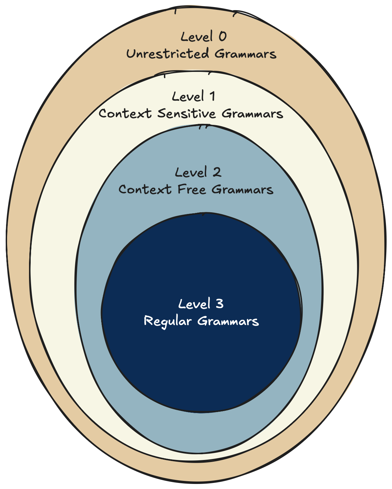
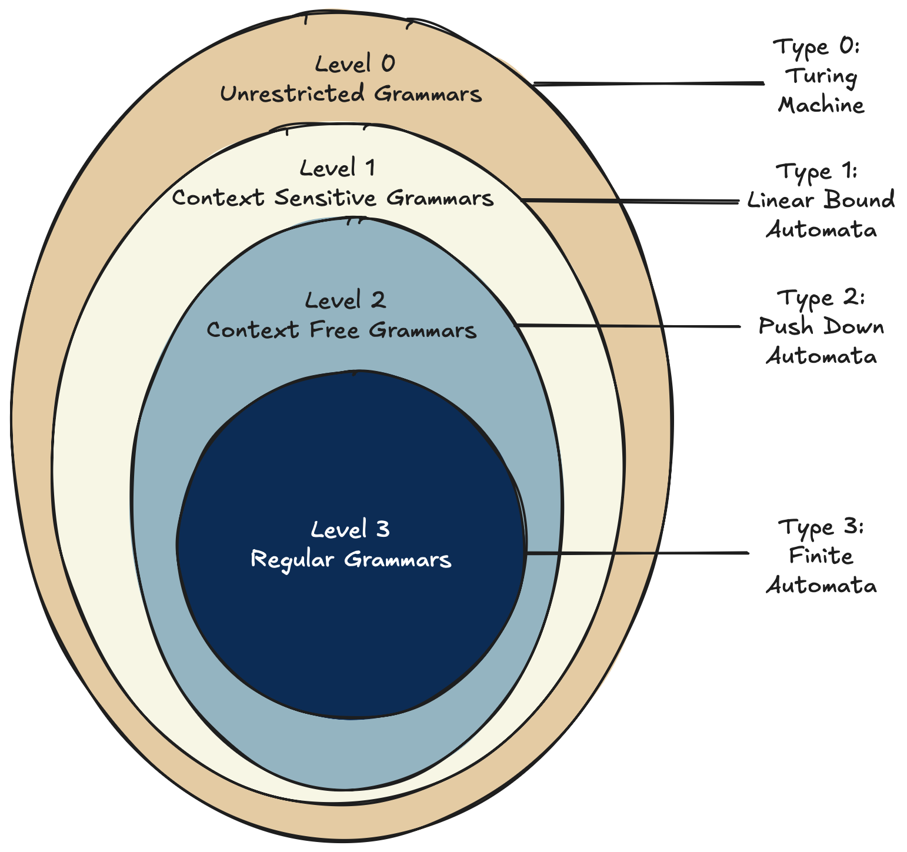
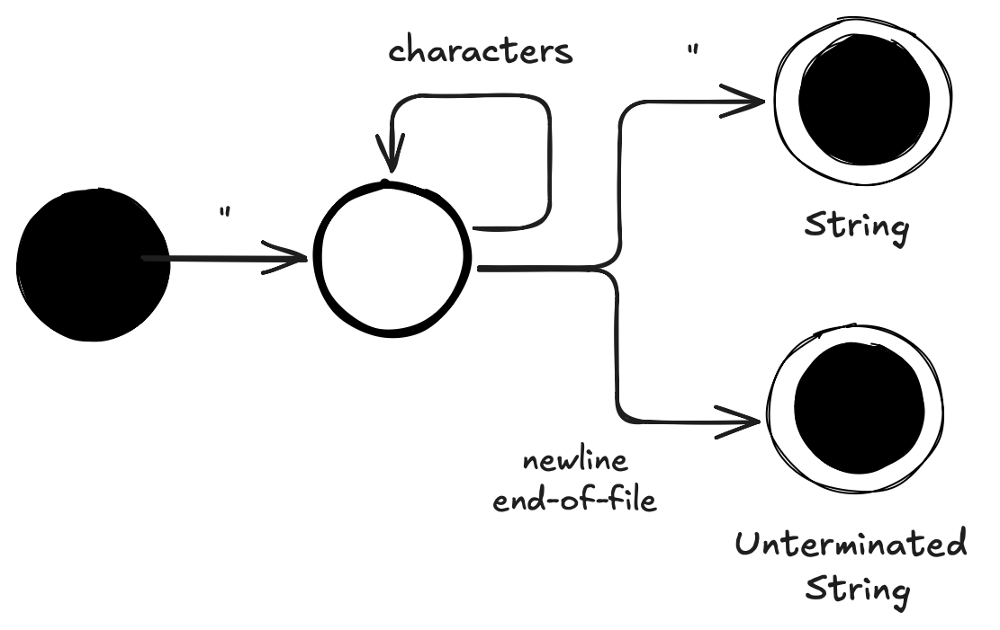
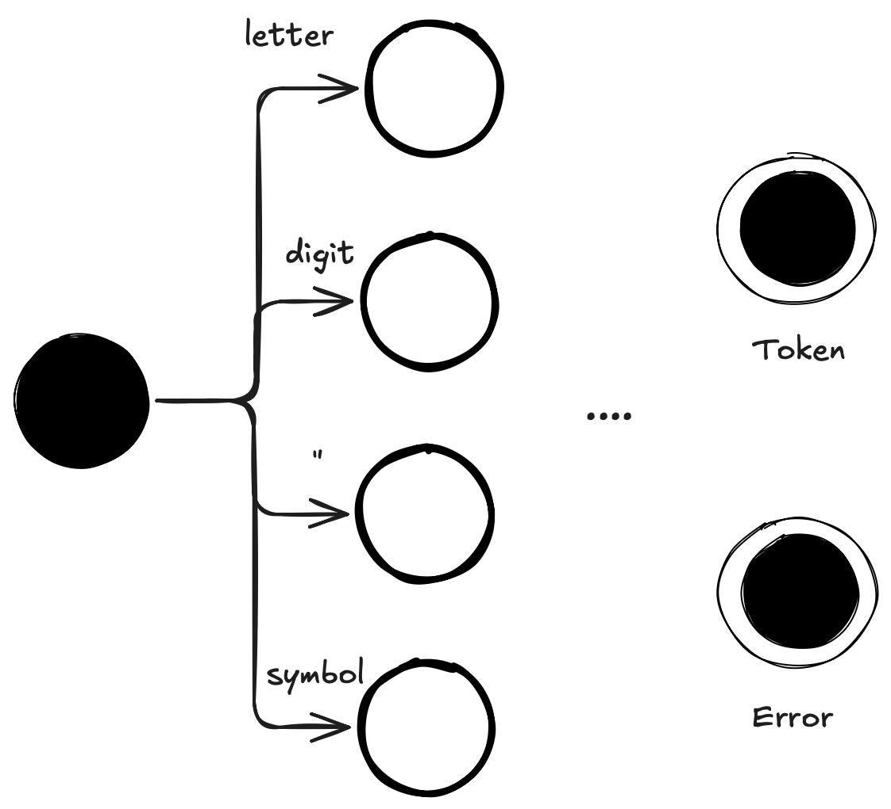

The lexer is the first phase in the compiler chain, the phase that translates the raw source code into a stream of tokens. 
A token is a sequence of characters that represents a meaningful unit in the source language, such as a keyword, an identifier, a number, or an operator. 
The lexer is also known as the scanner or the tokenizer. 
It is responsible for breaking the source code into its constituent parts and categorizing them according to their role in the language.
Before we embark on the adventure of building such a beast, let's briefly discuss the theoretical foundations of lexing and how it fits into the broader context of programming languages and compilers.

## Chomsky Hierarchy
Noam Chomsky is a ligusitic and a mathematician who introduced the Chomsky hierarchy, a classification of formal languages based on their generative power.

The Chomsky Hierarchy spans from the very limited regular languages (level 3) to the unrestricted languages (level 0) capable of generating every known language, natural or artificial.
### Regular Languages
Regular languages are the simplest class of languages in the Chomsky hierarchy. This means they are very easy to generate. 
A regular language can be generated recursively from a very simple set of rules

The following are regular languages:
> - ∅ (the empty set) is a regular language  
> - ε (the empty string) is a regular language 
> - a (a single symbol) is a regular language

And these combination operators can be used to generate more complex regular languages:
> - If A and B are regular languages, then A ∪ B (the union of A and B) is a regular language.
> - If A is a regular language, then A* (the Kleene star, the repetition of A) is a regular language.
> - If A and B are regular languages, then AB (the concatenation of A and B) is a regular language.

These simple rules allow us to generate a wide variety of regular languages, which are the basis for the lexing phase of a compiler.
## Turing Machines
Alan Turing was a mathematician who studied the concept of computability and introduced the Turing machine, a theoretical model of computation that can simulate any algorithm.
Turing categorized computational problems into three classes, depending on the resources required to solve them. 
This categorization is known as the Turing hierarchy and matches the Chomsky hierarchy as shown below:

Before we discuss finite automatas a bit more, I like to pause and just observe. 
Honestly, I find it fascinating the works of two humans, Noam Chomsky and Alan Turing, reached some of the same conclusions. 
Chomsky from the perspective of language and Turing from the perspective of computation. 
The smallest class of languages, the regular languages, can be generated by finite automatas and solved by finite state machines, the most limited computational model.
### Finite Automatas
A finite automaton is a theoretical model of computation that consists of a finite number of states and transitions between those states. 
No memory, because every state transition is determined solely by the current state and the input symbol.
That could be built basically hardwiring a circuit based on simple electronic components.
More formally, a finite automata can be defined as 
> a 5-tuple (Q, Σ, δ, q0, F) where:
> - Q is a finite set of states: {q0, q1, q2, ..., qn}
> - Σ is a finite set of input symbols (the alphabet): {a, b, c, ..., z}
> - δ is the transition function: δ: Q × Σ → Q, which defines how the automata transitions from one state to another based on the input symbol.
> - q0 is the initial state: q0 ∈ Q, which is the state where the automata starts.
> - F is the set of accepting states: F ⊆ Q, which are the states that indicate successful acceptance of the input string.

The finite automata processes a string of input symbols by starting in the initial state and following the transitions defined by the transition function δ based on the input symbols.
It can be shown (but I won't even though it could be fun) that the rules for generating regular languages can be implemented using finite automatas. 
And it can also be shown the finite automatas is only capable of recognizing regular languages, which will have an effect on our Oberon compiler. 
### Drawing Finite Automatas
While there is a formal definition of finite automatas, they are usually drawn as state diagrams as shown below

The diagram showing the state machine for a string initiated (the black circle) by a " character. 
This brings the automata into an interim state (open circle), and characters will continously be read in this state
until either a new " is met and transitioning into the string end state (a black circle in an open circle), 
or a newline or end-of-file transitioning into the unterminated string end state.

The parsing concerning the alternative elements of a language can similarly be shown as other automata, that again can be combined into larger automata.
## Lexing Oberon
In Oberon we will work with a lexer that recognizes the following tokens:
> - Keywords: `MODULE`, `BEGIN`, `END`, `VAR`, `PROCEDURE`, etc.
> - Identifiers: variable names, procedure names, etc.
> - Literals: numbers and strings.
> - Symbols as operators: `+`, `-`, `*`, `/`, etc. or punctuation: `;`, `,`, `(`, `)`, etc.

These can be handled by an automata looking at the initial character and then split out as shown below:

This diagram is represented in the code base.
### Lexer
The Oberon lexer is represented in the code by the _Lexer_ module. It defines the method _next_token_ capable of producing the next token
based on the current position in the source input. And it works similar to the state machine above. 
Based on the first character read, one of four functions are called to provide the actual implementation of the relevant automata.

But does it mean we simulate a finite automate all the way through - not really. Programming languages were invented to handle 
 complexity, and building automata is a complex task. Classic lexer generators such as [Lex](https://en.wikipedia.org/wiki/Lex_(software)) 
 generate an finite automata like the 5-tuple definition above, and honestly the generated code is unreadable and not just because it is in C.
 Instead, we create the methods not focusing on the mathematical correct definition, but doing techniques that simulate a finite automata anyway.

We simply avoid using memory dynimically. Instead we iterate the source code input, 
looking at each character and continue until we either have identified an Oberon token or reached an error. 
The heart of the matter is that during this iteration process, we do not fiddle with dynmically changing memory. 
Yes, it is true we have a vector of keywords, but that is a static vector preallocated. It is a part of the automata.
And yes, we are keeping track of the start of a lexeme, the current position, if we are parsing a hexadecimal number, and probably more.
But they are all a part of the machine. We do not have any thing in the machine that will vary according to the input. 
Every input requires the same machine to be lexed and nothing in the layout of the lexer changes. It is a finite automata.

### Comments
The lexer will not be able to recognize comments though:
> - Comments: `(* This is a comment *)`

This is because comments in Oberon can be nested, which requires a memory of how many levels of nesting we are currently in. 
This is a problem because regular languages, and thus finite automatas, cannot have memory.
Instead, we will have to handle comments in a separate phase, either before or after the lexing phase. 
A phase based on a pushdown automaton, which can recognize context-free languages. 
We will handle comments in the next post focusing on the foundation of the parser.

## Links
* [Oberon Language Report](https://people.inf.ethz.ch/wirth/Oberon/Oberon07.Report.pdf)
* [Chomsky Hierarchy](https://en.wikipedia.org/wiki/Chomsky_hierarchy)
* [Regular Languages](https://en.wikipedia.org/wiki/Regular_language)
* [Turing Machine](https://en.wikipedia.org/wiki/Turing_machine)
* [Finite-State Machine](https://en.wikipedia.org/wiki/Finite-state_machine)
* [Source Code](https://github.com/mikkela/oberon-compiler/tree/lexer)
