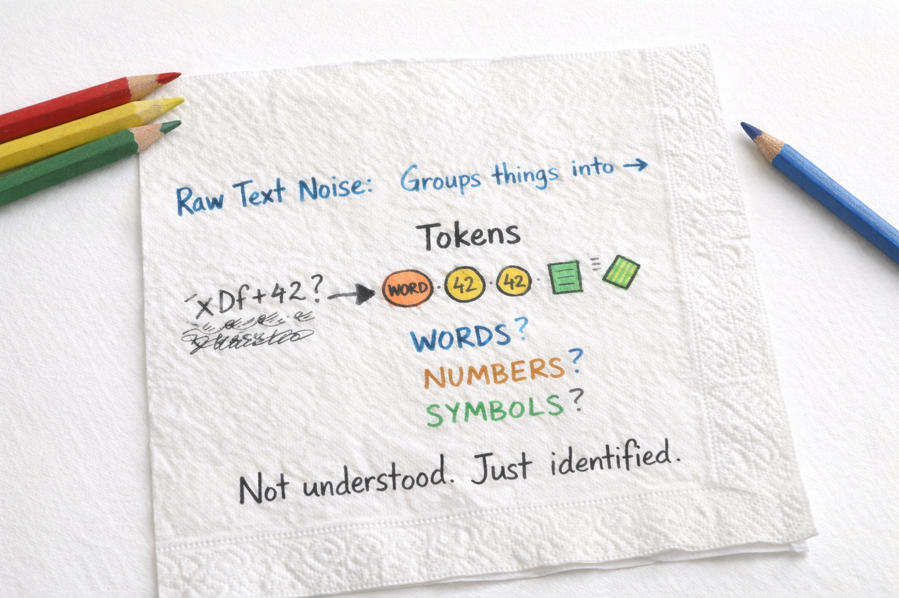
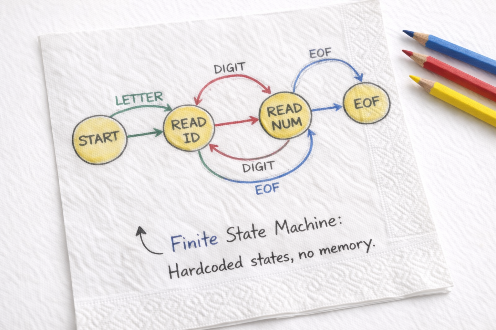

Programming languages are just insanely fascinating, Lucy said, taking a sip of her coffee.

They were sitting at their regular café. The napkins were thin, the coffee strong, the table already cluttered with half-finished thoughts.

---

## The First Step: Lexing

Lucy followed the lines on the napkin with her finger.

So this first box…  
*Lex.*

She looked up.

What is it actually doing?

Sancho answered without ceremony.

It recognizes things.  
Nothing more.

Recognizes what?

Words, Sancho said.  
Or at least the shapes that *could* be words.

Merlin nodded.

Lexing is the point where raw text stops being noise.  
Characters are grouped into symbols —  
not understood, merely *identified*.

Lucy tilted her head.

So it already understands the language?

No, Sancho said.  
It only knows what is allowed to *enter* the next stage.



---

Lucy paused.

What kind of machine can do that?

Merlin leaned back slightly.

That question has an old answer.  
Older than compilers.

Lexers operate within the lowest levels of Chomsky’s hierarchy.  
Regular languages.  
Finite automata.

Lucy blinked.

That sounds… small.

Deliberately, Merlin said.  
A finite machine has no memory of structure.  
No stack. No nesting.  
Only recognition of patterns.



Sancho added:

Which is exactly why it’s fast.  
And predictable.

---

So lexing is cheap? Lucy asked.

Sancho shrugged.

Linear time.  
No surprises.

Merlin continued calmly.

And that limitation is a feature, not a flaw.  
The lexer must not grow clever.

---

Lucy traced the arrow downward on the napkin.

So structure comes later.

Yes, Sancho said.  
That’s not the lexer’s job.

Merlin nodded.

Structure requires memory.  
Nested relationships.  
A different class of machine entirely.

Lucy hesitated.

Context-free?

Merlin smiled.

Precisely.  
Pushdown automata.  
A stack.

Sancho tapped the napkin.

Which means it doesn’t belong here.

---

Lucy looked thoughtful.

Then… what about comments?

Sancho stopped drawing.

Merlin’s expression softened.

That depends on their shape.

Oberon comments can nest, Lucy said slowly.

Merlin inclined his head.

And nesting breaks regularity.  
Such comments are not regular languages.  
A finite automaton cannot recognize them.

Sancho picked up the pencil again.

So we don’t try.

Lucy looked at him.

We don’t?

No, Sancho said.  
If the lexer pretends it understands nesting,  
it’s lying about what it is.

Merlin added quietly.

When a phase claims more power than it has,  
clarity is lost.

---

Lucy smiled.

So in the Oberon compiler…

…the lexer ignores comments, Sancho said.  
They pass through untouched.

Merlin raised a finger.

Not because they are unimportant —  
but because they require a stronger machine.

Lucy folded the napkin carefully.

So lexing is recognition.  
Parsing is understanding.

Merlin nodded.

And respecting that boundary  
is the first honest decision in a compiler.

Sancho set the pencil down.

Next time,  
we build the machine that remembers.

---

## Sidebar: Chomsky’s Hierarchy (and why lexing stays small)

> **TL;DR**  
> Lexing is usually **regular-language recognition** (finite automata).  
> Parsing is usually **context-free recognition** (pushdown automata).  
> Don’t let the lexer pretend it has a stack.
>
> ### The hierarchy at a glance
>
> Chomsky’s hierarchy classifies languages by the *power needed to recognize them*.
>
> ```text
> Type-3  Regular            ⊂
> Type-2  Context-free       ⊂
> Type-1  Context-sensitive  ⊂
> Type-0  Recursively enumerable
> ```
>
> A good compiler design respects these boundaries:  
> simpler phases do simpler work.
>
> ---
>
> ### Types, grammars, and machines
>
> | Level | Language class | Grammar form (informal) | Recognizer (machine) | Typical compiler role |
> |------:|----------------|--------------------------|----------------------|------------------------|
> | Type-3 | Regular | No nesting; flat patterns | **Finite automaton** (DFA/NFA) | **Lexer** |
> | Type-2 | Context-free | Nested structure | **Pushdown automaton** (stack) | **Parser** |
> | Type-1 | Context-sensitive | Context-dependent constraints | Linear bounded automaton | Rare in practice |
> | Type-0 | Recursively enumerable | Anything computable | Turing machine | General computation |
>
> ---
>
> ### Why lexers live in Type-3
>
> A lexer is excellent at recognizing:
>
> - identifiers (`foo`, `Bar123`)
> - numbers (`42`, `3.14`)
> - operators (`:=`, `+`, `<=`)
> - whitespace and separators
>
> These patterns are *flat*.  
> They do not require remembering how deeply nested you are.
>
> A lexer is intentionally limited:
>
> - no stack
> - no recursion
> - no structural memory
>
> That is why it is fast, predictable, and easy to reason about.
>
> ---
>
> ### Why parsers live in Type-2
>
> Parsers handle **nesting**:
>
> - parentheses `( … ( … ) … )`
> - blocks `BEGIN … END`
> - structured statements and expressions
>
> Nesting is exactly what a stack is for.  
> That is the jump from regular to context-free.
>
> ---
>
> ### The Oberon comment twist
>
> Oberon comments can nest:
>
> ```text
> (* outer (* inner *) still outer *)
> ```
>
> Nested comments are **not regular**.  
> Recognizing balanced open/close pairs requires a stack.
>
> Therefore, in the Oberon compiler:
>
> - the **lexer does not handle comments**
> - because doing so would quietly turn it into a context-free recognizer
>
> We keep lexing honest — and small.
>
> **Next time:** we build the machine that remembers.  
> That is where nested comments belong.

## Links
- [Oberon Language](https://people.inf.ethz.ch/wirth/Oberon/Oberon07.Report.pdf)
- [Source Code](https://github.com/mikkela/oberon-compiler/tree/lexing)
