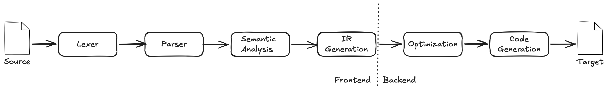

Building a compiler has always been a fascinating challenge for me. Ever since I had a compiler course at my third year in college. 
Well, we didn't exactly build a compiler, instead we ended building an evaluator of Scheme. 
While I was glad to complete the course (it was getting very close to Christmas, the hours had been long, Scheme was hard to undserstand,..), it left me somewhat unsatisfied. I haven't built a complete compiler, only some of the initial steps.
--
## What is a compiler?
Before jumping into the tasks, let's briefly discuss what a compiler is. 
A compiler is a program that translates source code written in one programming language (the source language) into another programming language (the target language). 
The most common use of a compiler is to translate high-level programming languages (like C, Rust, or Oberon) into machine code that can be executed by a computer's CPU.
This is the core magic that always fascinated me, right from the first time I wrote a program. Back then the code was BASIC and it got interpreted, not compiled (we'll get to the difference). It was still magic, though, and I was taken.
--
## How does a compiler work?
How does this translation work then? I have drawn up the traditional compiler pipeline below, the pipeline we also will follow.

The pipeline is divided into two main parts: the front-end and the back-end. The front-end is responsible for analyzing the source code and building an intermediate representation (IR) of the program. The back-end takes this IR and generates the target code.
This means that the front-end is mostly concerned with the syntax and semantics of the source language, while the back-end is concerned with the target architecture and optimization. What does this mean in the daily works? 
We can build a compiler for one target architecture and then change the backend and have it compile to another architecture. The frontend can stay the same.
We might also have multiple frontends for the same backend, allowing us to compile different source languages to the same target architecture. 
Are we going to use these options now? No, we will build one frontend for Oberon and one backend for the RISC processor designed for the Oberon project. Nothing more, nothing less.
A well-defined systems architecture is still valuable though, and we will have an intermediate representation to communicate between the frontend reading and parsing Oberon and the back end producing the RISC code.

### The Front-end
The front-end of a compiler is responsible for analyzing the source code and building an intermediate representation (IR) of the program. It is done in the following phases:
* Lexer: The lexer takes the source code as input and produces a stream of tokens. A token is a sequence of characters that represents a meaningful unit in the source language, such as a keyword, an identifier, a number, or an operator.
* Parser: The parser takes the stream of tokens produced by the lexer and builds an abstract syntax tree (AST). The AST is a tree-like data structure that represents the syntactic structure of the source code. Each node in the AST corresponds to a construct in the source language, such as a procedure definition, a variable declaration, a sequence of statements, or an expression.
* Semantic Analysis: The semantic analysis checks the AST for semantic errors and builds a symbol table. The symbol table is a data structure that maps identifiers (such as variable names and procedure names) to their corresponding types and other relevant information. The semantic analysis phase also performs type checking, ensuring that operations are performed on compatible types and that variables are used correctly.
* Intermediate Representation (IR) Generation: The IR generation takes the AST and the symbol table and produces an intermediate representation of the program. The IR is a lower-level representation that is easier to manipulate and optimize than the AST. It is often designed to be independent of the source language and the target architecture, allowing for greater flexibility in the compiler design as we have discussed.

We will build the frontend first in a series of steps, starting with the lexer.

### The Back-end
The back-end of a compiler is responsible for taking the intermediate representation (IR) produced by the front-end and generating the target code. It is done in the following phases:
* Optimization: The optimization takes the IR and applies various transformations to improve the performance of the generated code. This can include techniques such as constant folding, dead code elimination, loop unrolling, and register allocation.
* Code Generation: The code generation takes the optimized IR and produces the target code. This involves mapping the IR constructs to the instructions of the target architecture, as well as handling issues such as register allocation, instruction selection, and calling conventions.

Well completing the backend will finish our Oberon compiler. So let's get started, rock and roll!

## Links
* [Oberon](https://en.wikipedia.org/wiki/Oberon_(programming_language))
* [RISC](https://en.wikipedia.org/wiki/RISC)
* [Compiler](https://en.wikipedia.org/wiki/Compiler)
* [Project Oberon](https://projectoberon.net)
* [Oberon Language Report](https://people.inf.ethz.ch/wirth/Oberon/Oberon07.Report.pdf)
* [Oberon RISC Architecture](https://people.inf.ethz.ch/wirth/FPGA-relatedWork/RISC-Arch.pdf)
* [Oberon RISC Design](http://www.inf.ethz.ch/personal/wirth/FPGA-relatedWork/RISC.pdf)
